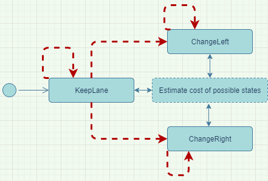

# Highway Driving

This repository contains the implementation of the "Highway Driving" Project for Udacity Course Self-Driving Car Engineer.

## Goals

A Self-Driving Car must be able to plan a safe and efficient route.

**Safety requirements**:
-	The car must not leave the road
-	The car must not collide with any vehicle or another obstacle
-	The car must plan the route only following General Rules and use only allowed lanes
-	The car must not behave aggressively. The next is not allowed:
 -	Occupy the leftmost lane without reasons for a long time
 -	Aggressive maneuvers such as changing lanes right in front or from behind another vehicle
 -	Pushing the speed limit. In the current project, it's 50 MPH
 -	Driving too slow. It's possible to drive a little bit slower than the provided speed limit, but not slower than 45 MPH if the road is clear ahead
-	The car must provide comfortable driving for its passengers. The next is not allowed:
-	Aggressive acceleration (> 10m/s**2)
- Aggressive jerking (> 50m/s**3)
-	Aggressive maneuvers with a small radius of turning curve

**Efficiency requirements**:
-	The car able to pass a slowly driving vehicle
-	The car uses the rightmost lane as much as possible
- The ability to drive at least the complete loop of around 6 km (takes about 5 minutes)

---
## Project Overview

The project contains two main components – the planning service and Udacity Simulator.
The service is a C++ application. It uses [uWebSockets](https://github.com/uWebSockets/uWebSockets) for network communications.
The simulator sends the telemetry data as a JSON object to the planning service and gets the trajectory back.
Data formats presented below are pseudo-JSON, comments, and values only for explanation.

### Simulator
You can download the Term3 Simulator which contains the Path Planning Project from the [releases tab (https://github.com/udacity/self-driving-car-sim/releases/tag/T3_v1.2).

To run the simulator on Mac/Linux, first make the binary file executable with the following command:
```shell
sudo chmod u+x {simulator_file_name}
```

**Simulator data format**:

```json
{
	// Main car's localization Data (No Noise)
	"x": 0.0, // The car's x position in map coordinates
	"y": 0.0, // The car's y position in map coordinates
	"s": 0.0, // The car's s position in frenet coordinates
	"d": 0.0, // The car's d position in frenet coordinates
	"yaw": 0.0, // The car's yaw angle in the map
	"speed": 0.0, // The car's speed in MPH

	// Previous path data given to the Planner
	"previous_path_x": [], // The previous list of numbers of x points previously given to the simulator
	"previous_path_y": [], // The previous list of numbers of y points previously given to the simulator

	// Previous path's end s and d values
	"end_path_s": [], // The previous list's last point's frenet s value
	"end_path_d": [], // The previous list's last point's frenet d value

	"sensor_fusion": [ // A list of lists of cars
	  [ // Car format data
		0, // Car ID
		0.0, 0.0, // Cartesian coordinates
		0.0, 0.0, // Velocity components X and Y
		0.0, 0.0 // Frenet coordinates
	  ]
	]
}
```

**Trajectory data format**:

```json
{
  "next_x": [], // The list of numbers of X component of the trajectory
  "next_y": [] // The list of numbers of Y component of the trajectory
}
```

### The map of the highway is in data/highway_map.txt

Each waypoint in the list contains  [x,y,s,dx,dy] values. x and y are the waypoint's map coordinate position, the s value is the distance along the road to get to that waypoint in meters, the dx and dy values define the unit normal vector pointing outward of the highway loop.

The highway's waypoints loop around so the frenet s value, distance along the road, goes from 0 to 6945.554.


### Additional details:

1. The car uses a perfect controller and will visit every (x,y) point it receives in the list every .02 seconds. The units for the (x,y) points are in meters, and the spacing of the points determines the car's speed. The vector going from a point to the next point in the list dictates the car's angle. Acceleration both in the tangential and normal directions is measured along with the jerk, the total acceleration change rate. The (x,y) point paths that the planner receives should not have a full acceleration over 10 m/s^2. Also, the jerk should not go over 50 m/s^3. (NOTE: As this is BETA, these requirements might change. Also, currently, jerk is over a .02 second interval. It would probably be better to average total acceleration over 1 second and measure jerk from that.

1. There will be some latency between the simulator running and the path planner returning a path. Usually, with optimized code, it's not very long, maybe just 1-3 time steps. During this delay, the simulator will continue using points that it was last given. Because of this, it's a good idea to store the last points you have used so you can have a smooth transition. previous_path_x and previous_path_y can help this transition since they show the previous points given to the simulator controller with the processed points already removed. You would either return a path that extends this previous path or create a new way to smooth transition with this last path.
---
## Solution

The route planner uses sensor fusion data to find the closest vehicles around the ego vehicle in each correct lane. Then planner uses the Finite State Machine to find the optimal behavior.

The State Machine has the following diagram:



When the car receives telemetry data, it updates the State Machine. Each state has potential transitions (red arrows on the diagram). The current state estimates the cost of each possible change. Then the transition with the lowest cost is performing.

The planner calculates the cost according to the following rules:
- Each estimation has a weight. Than bigger the weight, than more significant the estimation. For the explanation, let’s call them O1, O2, O3 (in ascending order)
- Sequentially use estimations:
  -	Keep the Lane or Prefer the Right: O1
  - Car must stay on the road: O3
  - Overtake if possible: O1
  - Avoid collisions: O2-O3 depending on the distance of the car in front
  - Use an adjusted free lane: O1
  - Keep the lane while reaching a minimum safe speed: O3

All these functions might be found in the [FSM](src/FSM.cpp).

---

## Dependencies

* cmake >= 3.5
  * All OSes: [click here for installation instructions](https://cmake.org/install/)
* make >= 4.1
  * Linux: make is installed by default on most Linux distros
  * Mac: [install Xcode command line tools to get make](https://developer.apple.com/xcode/features/)
  * Windows: [Click here for installation instructions](http://gnuwin32.sourceforge.net/packages/make.htm)
* gcc/g++ >= 5.4
  * Linux: gcc / g++ is installed by default on most Linux distros
  * Mac: same deal as make - [install Xcode command line tools]((https://developer.apple.com/xcode/features/)
  * Windows: recommend using [MinGW](http://www.mingw.org/)
* [uWebSockets](https://github.com/uWebSockets/uWebSockets)
  * Run either `install-mac.sh` or `install-ubuntu.sh`.
  * If you install from source, checkout to commit `e94b6e1`, i.e.
    ```
    git clone https://github.com/uWebSockets/uWebSockets
    cd uWebSockets
    git checkout e94b6e1
    ```
* [Spline library](http://kluge.in-chemnitz.de/opensource/spline/)

## Basic Build Instructions

1. Clone this repo.
2. Make a build directory: `mkdir build && cd build`
3. Compile: `cmake .. && make`
4. Run it: `./path_planning`